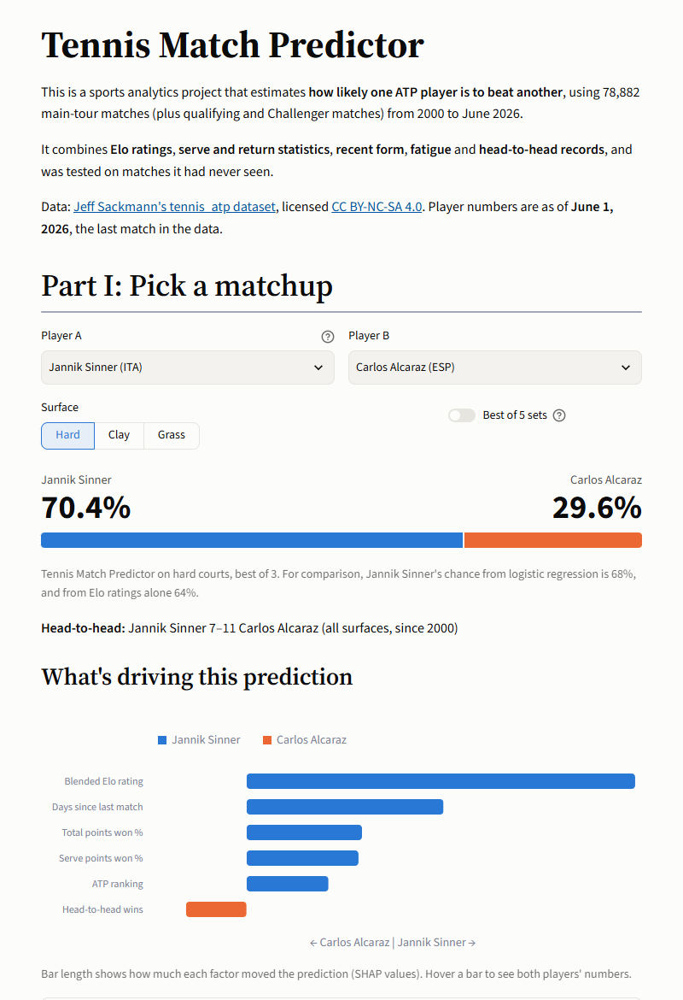
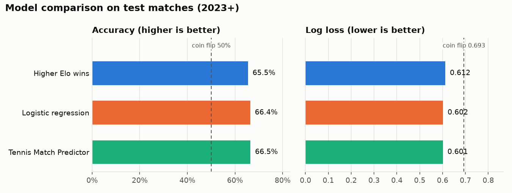
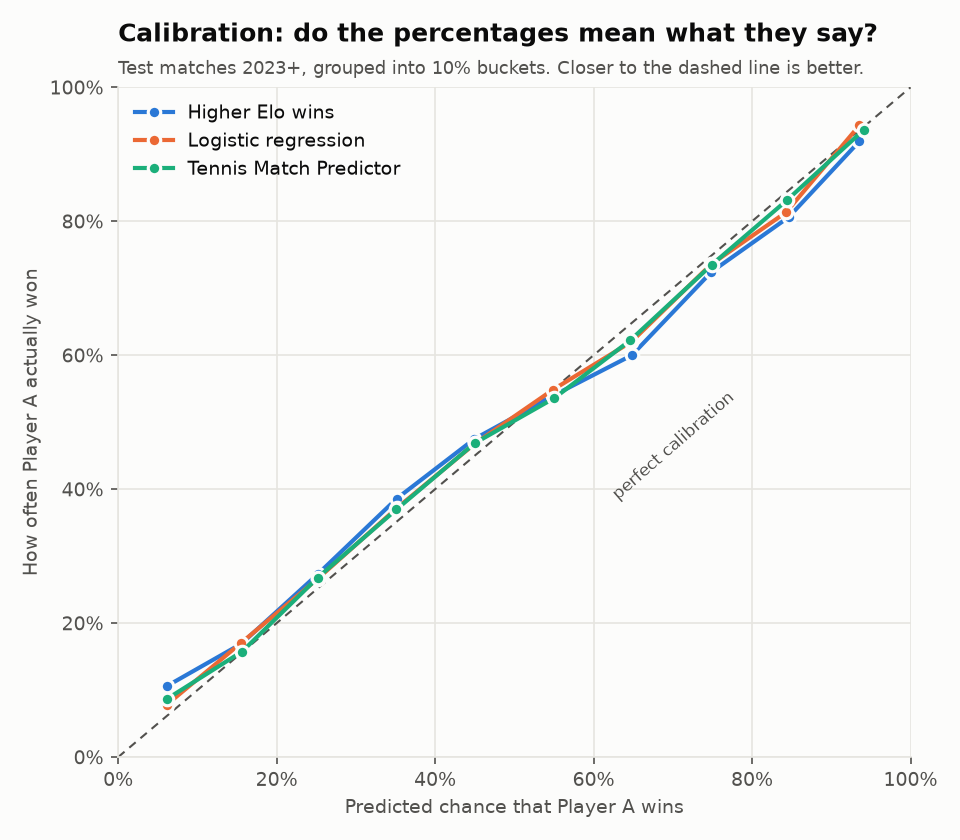
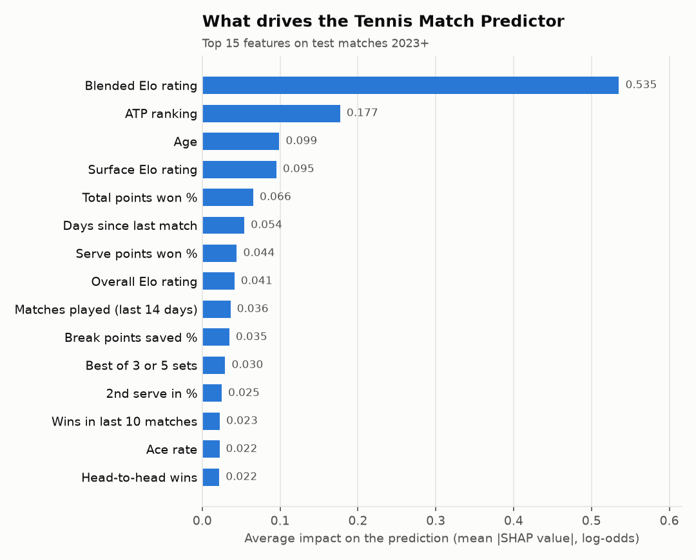

# 🎾 Tennis Match Predictor

A sports analytics project that estimates **the probability that one ATP tennis player beats
another**, using 26 years of match data. It combines Elo ratings, serve and return statistics,
recent form, fatigue and head-to-head records, and it was tested only on matches it had never seen.



## Why I built this

Commentators say things like "he's in great form" or "she always struggles against lefties",
but how much do those things actually matter? I wanted to find out with data: build a model
that gives a real percentage for any matchup, test it honestly, and see which factors
decide tennis matches.

## Data

All match data comes from **Jeff Sackmann's [tennis_atp](https://github.com/JeffSackmann/tennis_atp)
dataset** (© Jeff Sackmann / Tennis Abstract), licensed under
[CC BY-NC-SA 4.0](https://creativecommons.org/licenses/by-nc-sa/4.0/).

- `atp_matches_YYYY.csv`: main-tour matches, 2000 to 2026 (78,882 matches)
- `atp_matches_qual_chall_YYYY.csv`: tour-level qualifying and Challenger matches (190,538 more)

> **Note:** As of September 2026 the original repository is no longer publicly available on
> GitHub. The download script tries it first, then falls back to public forks whose latest
> commit is Jeff Sackmann's own (June 8, 2026). The data therefore ends on **June 1, 2026**.

Cleaning steps:
- Walkovers (`W/O`) are dropped because the match was never played.
- Retirements (`RET`) are kept and flagged.
- All matches are sorted into the order they were played.

Because the data license is ShareAlike, the processed files in `app_data/` are shared under
the same CC BY-NC-SA 4.0 license, non-commercially.

## Method

The core rule throughout: **every feature for a match is computed only from matches played
before it.** Nothing from the future leaks in.

| Step | File | What happens |
|---|---|---|
| 1. Load | [`src/data_loader.py`](src/data_loader.py) | Downloads the CSVs, removes walkovers, flags retirements, and sorts by date, tournament and round. |
| 2. Elo | [`src/elo.py`](src/elo.py) | Everyone starts at 1500 with an overall rating plus Hard, Clay and Grass ratings. The K-factor shrinks with experience: `K = 250 / (matches + 5)^0.4`. |
| 3a. Serve stats | [`src/serve_stats.py`](src/serve_stats.py) | 11 stats (1st serve in %, 1st and 2nd serve points won, aces, double faults, break points saved and converted, return points won, total points won), each over the player's previous 20 matches. |
| 3b. Features | [`src/features.py`](src/features.py) | Adds rust (days since last match), fatigue (minutes and matches in the last 14 days), injury proxy (retirements in the last 90 days), form (wins in the last 10), head-to-head, ranking and age. Each is turned into a **Player A minus Player B** difference, and a seeded coin flip decides who is "Player A" so the label isn't always the winner. |
| 4. Models | [`src/train.py`](src/train.py) | A time-based split trains on 2000–2021, validates on 2022 and tests on 2023 onward. Compares a higher-Elo-wins baseline, logistic regression and the **Tennis Match Predictor** (our main model, built with XGBoost). |
| 5. App | [`app.py`](app.py), [`src/matchup.py`](src/matchup.py) | Streamlit app: pick two players and a surface to get a probability and the reasons behind it. |

Models are trained and tested on **main-tour matches**. Qualifying and Challenger matches
are used only to build ratings and stats, so young players arrive on the tour with a history.

## Results

Test set: **10,382 main-tour matches** (January 2023 to May 2026), never seen during training.

| Model | Accuracy | Log loss ↓ | Brier score ↓ |
|---|---|---|---|
| Higher Elo wins (baseline) | 65.5% | 0.612 | 0.213 |
| Logistic regression | 66.4% | 0.602 | 0.208 |
| **Tennis Match Predictor** | **66.5%** | **0.601** | **0.208** |

*Accuracy* is how often the favourite won. *Log loss* and *Brier score* measure the quality of
the percentages themselves (a coin flip scores 0.693 and 0.250).

| Matches | Higher Elo wins | Logistic regression | Tennis Match Predictor |
|---|---|---|---|
| Grand Slams (best of 5) | 70.8% | 72.0% | 72.7% |
| Other tour events | 64.4% | 65.3% | 65.2% |
| Hard / Clay / Grass | 66.3 / 64.3 / 64.2% | 66.7 / 65.9 / 66.1% | 66.7 / 66.2 / 66.0% |

<p>
  
</p>
<p>
  
  
</p>

### What the results mean

- **About 2 in 3 is a realistic ceiling for tennis.** Upsets are part of the sport, and a
  best-of-3 match can turn on a few points.
- **Elo does most of the work.** One number per player already reaches 65.5%. The extra
  features add about one percentage point of accuracy and a clear improvement in log loss.
  That's a small, real gain, because a player's rating already reflects most of what the
  extra stats know.
- **The percentages can be trusted.** In the calibration plot, when the model says 70%, the
  player wins about 70% of the time.
- **Grand Slams are the most predictable** (72.7%), because best of 5 gives the better player
  more time to come through.
- **What matters most:** Elo ratings and ranking by far, then age, total points won and rust
  (days since last match). Head-to-head records add surprisingly little once player strength
  is known.

Full write-up: [`outputs/results_summary.md`](outputs/results_summary.md)

### Limitations

- The data only contains results and match statistics. It knows nothing about injuries,
  illness, motivation, weather or scheduling.
- Only each tournament's **start date** is recorded, so rest days and fatigue windows are
  estimates.
- Serve and return stats treat every opponent the same. Elo is the part of the model that
  adjusts for opponent quality.
- Ratings for players with few matches are still settling.
- The app describes players **as of June 1, 2026**, when the data ends.
- The models learned from 2000–2021, and the game keeps changing.

## Run it locally

You need Python 3.11 or newer and Git.

```bash
# 1. Get the code
git clone https://github.com/sahishnu-m/tennis-match-predictor.git
cd tennis-match-predictor

# 2. Create a virtual environment and install the libraries
python -m venv .venv
.venv\Scripts\activate          # Windows
# source .venv/bin/activate     # macOS / Linux
pip install -r requirements.txt

# 3. Start the app (uses the ready-made files in app_data/)
streamlit run app.py
```

### Rebuild everything from scratch (optional)

```bash
python -m src.data_loader     # Phase 1: download + clean, print stats  (~1 min first time)
python -m src.elo             # Phase 2: Elo ratings + checkpoint
python -m src.serve_stats     # serve/return stats + checkpoint
python -m src.features        # Phase 3: build the model table (~15 s)
python -m src.train           # Phase 4: train, test, save charts and app files (~10 s)
```

`python -m src.features` runs Phases 1–3 by itself, so for a full rebuild you only need
the last two commands.

### Command-line predictions

```bash
python -m src.predict "Alcaraz" "Sinner" --surface Hard --best-of 5
python -m src.predict --replay "US Open" --year 2025 --round F
```

## Deploy for free on Streamlit Community Cloud

1. **Put the project on GitHub.** Create an empty repository on github.com, then run:
   ```bash
   git init
   git add .
   git commit -m "Tennis match predictor"
   git branch -M main
   git remote add origin https://github.com/sahishnu-m/tennis-match-predictor.git
   git push -u origin main
   ```
   The `data/` folder is ignored by `.gitignore` because it's large and can be re-downloaded.
   The app only needs `app_data/`, `outputs/`, `src/`, `app.py`, `requirements.txt` and
   `.streamlit/`, and all of those are included.
2. Go to **[share.streamlit.io](https://share.streamlit.io)** and sign in with GitHub.
3. Click **Create app**, then **Deploy a public app from GitHub**, and fill in:
   - **Repository:** `sahishnu-m/tennis-match-predictor`
   - **Branch:** `main`
   - **Main file path:** `app.py`
4. Open **Advanced settings** and choose **Python 3.12 or newer**.
5. Click **Deploy**. The first build takes a few minutes while the libraries install.
   Every later `git push` updates the app automatically.

## Project structure

```
├── app.py                  Streamlit web app
├── requirements.txt        Python libraries
├── .streamlit/config.toml  App theme
├── src/
│   ├── data_loader.py      Phase 1: download + clean
│   ├── elo.py              Phase 2: Elo ratings
│   ├── serve_stats.py      Rolling serve/return stats
│   ├── features.py         Phase 3: model table
│   ├── train.py            Phase 4: models, metrics, charts
│   ├── matchup.py          Predict any matchup (used by app + CLI)
│   └── predict.py          Command-line predictions
├── app_data/               Small files the app needs (model, player snapshot, test predictions)
├── outputs/                Charts + results summary
├── docs/                   README screenshot
└── data/                   Downloaded + processed data (ignored by git)
```

## Credits

- Match data: [Jeff Sackmann / Tennis Abstract](https://github.com/JeffSackmann/tennis_atp), CC BY-NC-SA 4.0
- Design inspiration: the Streamlit [movies demo](https://demo-movies.streamlit.app/)

This is an educational sports analytics project. Its percentages are estimates based on
past data.
